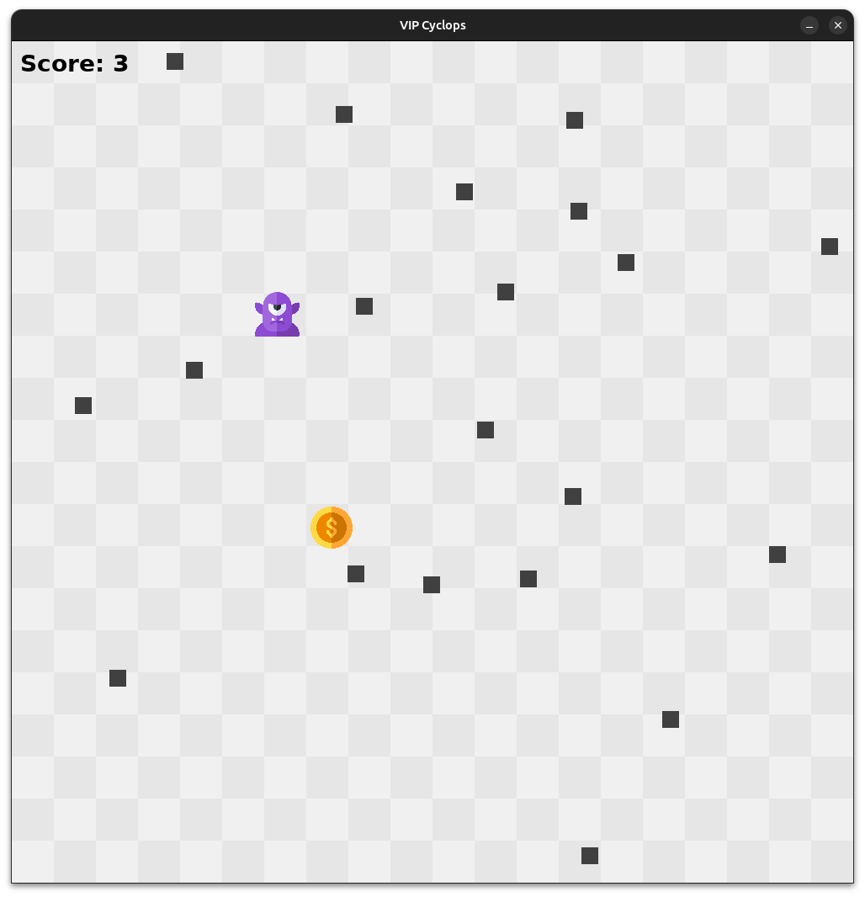

# VIP Cyclops Game Project (C-based game) 

## Description

VIP Cyclops is a 2D game developed using SDL2, where the player controls a cyclops character that collects coins while avoiding blockers. The character grows in size each time a coin is collected, and the game ends if the cyclops collides with a blocker. The player can reset the game by clicking the "Play Again" button when the game is over.

## Gameplay Example



## Requirements

- SDL2
- SDL2_ttf
- SDL2_image

## Installation

1. **Install SDL2, SDL2_ttf, and SDL2_image libraries** (on Debian-based systems):

   ```sh
   sudo apt-get install libsdl2-dev libsdl2-ttf-dev libsdl2-image-dev
   ```

2. **Clone the repository**:

   ```sh
   git clone <repository_url>
   cd <repository_directory>
   ```

3. **Build the project**:

   ```sh
   make
   ```

## Usage

1. **Run the game**:

   ```sh
   make run
   ```

   By default, it uses the DejaVuSans-Bold font. You can specify a different font path if desired:

   ```sh
   ./main /path/to/your/font.ttf
   ```

## Controls

- **Arrow Keys**: Move the cyclops
- **Mouse Click**: Click on "Play Again" to reset the game after game over

## Files

- `main.c`: Main source code for the game
- `Makefile`: Makefile for building the project
- `assets/cyclops.png`: Image file for the cyclops character
- `assets/coin.png`: Image file for the coin

## Makefile Targets

- `all`: Build the project
- `clean`: Remove the built files
- `rebuild`: Clean and build the project
- `run`: Run the game with a default font

Enjoy the game! If you encounter any issues or have suggestions, feel free to open an issue on the GitHub repository.
